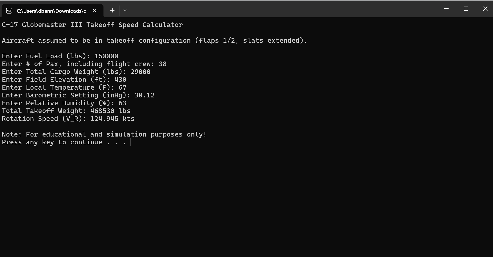

# C-17 Globemaster III Takeoff Speed Calculator

## Description
This C++ console-based application calculates the takeoff speed, or Rotation Speed \(VR) for a C-17 Globemaster III aircraft. 
The calculator considers various parameters such as fuel load, passenger and cargo weight, field elevation, and environmental conditions. 
It adjusts the VR factor for added safety margin at high field elevation or heavy loads. This calculator assumes that the aircraft is in takeoff
configuration, flaps 1/2, slats extended. This program also showcases the C-17s impressive lift generation capabilities.

## Features
- **Input Ops Parameters**: Users input the fuel load, passenger weight, cargo weight, and field elevation for calculations.
- **Environmental Adjustments**: The calculator adjusts the required takeoff speed based on user inputs of local temperature, barometric pressure, and humidity.
- **Dynamic Air Density Calculation**: Computes air density based on provided environmental inputs.
- **Variable VR Factor**: Increases the calculated VR to incorporate a safety margin for heavy loads or high field elevations.
- **Unit Conversion**: Values are input using units standard in American aviation, converted to metric for formulas, and converted back to the final output in knots.

### Air Density (ρ)
Air density is crucial for calculating the aircraft's performance, as it affects the lift generated by the wings. The formula for air density accounting for humidity is as follows:

- **Formula**: ρ = Pd / (R * T)
- **Where**:
  - (Pd) is the dry air pressure, which is the total air pressure minus the vapor pressure (P - Pv).
  - \( P \) is the total air pressure calculated from the barometric setting (in Pascals).
  - (Pv) is the vapor pressure, which depends on humidity and temperature.
  - \( R \) is the specific gas constant for dry air (287.05 J/(kg·K)).
  - \( T \) is the temperature in Kelvin.

**Vapor Pressure Calculation**:
Vapor pressure (Pv) can be estimated using the Magnus formula relative to temperature:
- **Formula**: Pv = 6.1078 × 10(7.5×Tc)/(237.3+Tc)
- (Tc) is the temperature in degrees Celsius.

**Conversion to Dry Air Pressure (Pd)**:
- **Formula**: Pd = P - Pv
- This formula adjusts the total pressure by subtracting the vapor pressure, thus focusing only on the dry part of the air.

### Key Assumptions
- The temperature provided should be converted from Fahrenheit to Celsius for use in the vapor pressure formula, then to Kelvin for the air density calculation.
- Humidity is taken as relative humidity (a percentage), which affects the calculation of vapor pressure.

**Calculating Relative Humidity Impact**:
Relative humidity is used to adjust the vapor pressure in the air density calculation:
- **Adjusted Vapor Pressure**: Pv = (Relative Humidity / 100) × Pv(calculated)

This inclusion of humidity makes the air density calculation sensitive to more realistic environmental conditions, which is crucial for accurate flight dynamics simulation.

### Stall Speed (VS)
Stall speed is the minimum speed at which the aircraft can maintain aerodynamic lift.
- **Formula**: VS = √(2W / (ρ * S * CL))
- **Where**:
  - \( W \) is the total weight of the aircraft in Newtons.
  - \( ρ \) (rho) is the air density in kg/m³.
  - \( S \) is the wing area in square meters.
  - (CL) is the lift coefficient, I used 3.156 (https://archive.aoe.vt.edu/mason/Mason_f/C17PresS07.pdf) for a C-17 in takeoff configuration.

### Takeoff Speed (VR)
Takeoff speed is calculated to ensure it includes a safety margin above the stall speed, usually 1.1 to 1.3.
- **Formula**: VR = VS * factor
- **Where**:
  - VS is the stall speed.
  - factor is the margin of safety above stall speed at which point it is safe to initiate rotation and leave the runway. I used 1.15 as the base factor, with +=0.05 modifiers for heavy load and high field elevations.

## Instructions for use ##
- Navigate to "releases" and download "c17vrspeedcalculator.exe". Windows 10 or later, 64-bit required.
- Double click the file after downloading, this should open the file in the command prompt.
- Enter the values as prompted. Here are some guidelines for those who are unfamiliar with C17 operations.
    - Fuel load is generally between 50,000 and 244,000(Max) lbs
    - Pax, or passengers, varies. Generally an aircrew will include 5, then additional passengers may occupy the cargo bay. 134 is max.
    - Cargo weight can vary up to 170,900 lbs, typical military vehicles may be between 25,000 and 50,000 lbs each. A single M1 Abrams tank weighs 144,000 lbs.
    - Field Elevation can be obtained via SkyVector or a simple google search. Sea-Tac Int'l (KSEA), for example, is at 432 ft MSL.
    - Local Temperature is simply the temperature at the airfield, for this application just use whatever weather reporting app you have.
    - Barometric pressure can also be obtained from your weather app, or if you want for the purposes of this simulation, you can use the standard at sea-level pressure 29.92 inHg.
    - Relative humidity is another factor easily obtained via your weather app.
    - Once you've entered all the prompted inputs, the program will return your total weight, and Rotation speed (VR).
- Press any key to exit, reopen the application to repeat program.

  
